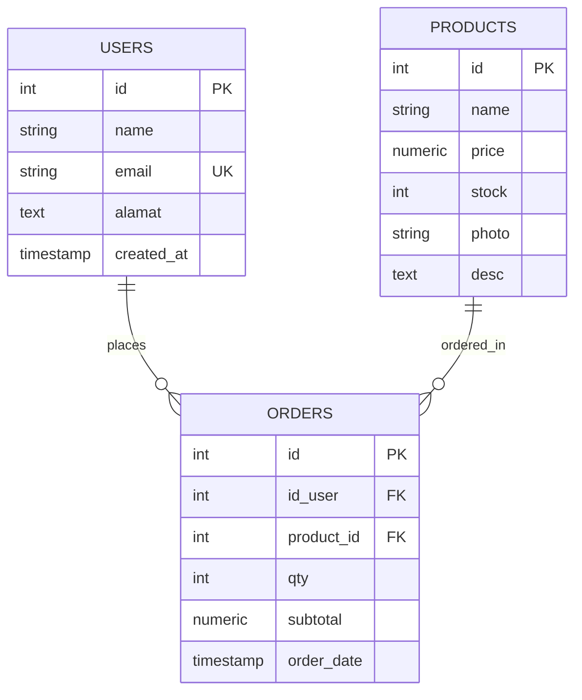

```mermaid

erDiagram
    USERS ||--o{ ORDERS : "places"
    PRODUCTS ||--o{ ORDERS : "ordered_in"

    USERS {
        int id PK
        string name
        string email UK
        text alamat
        timestamp created_at
    }

    PRODUCTS {
        int id PK
        string name
        numeric price
        int stock
        string photo
        text desc
    }

    ORDERS {
        int id PK
        int id_user FK
        int product_id FK
        int qty
        numeric subtotal
        timestamp order_date
    }
```